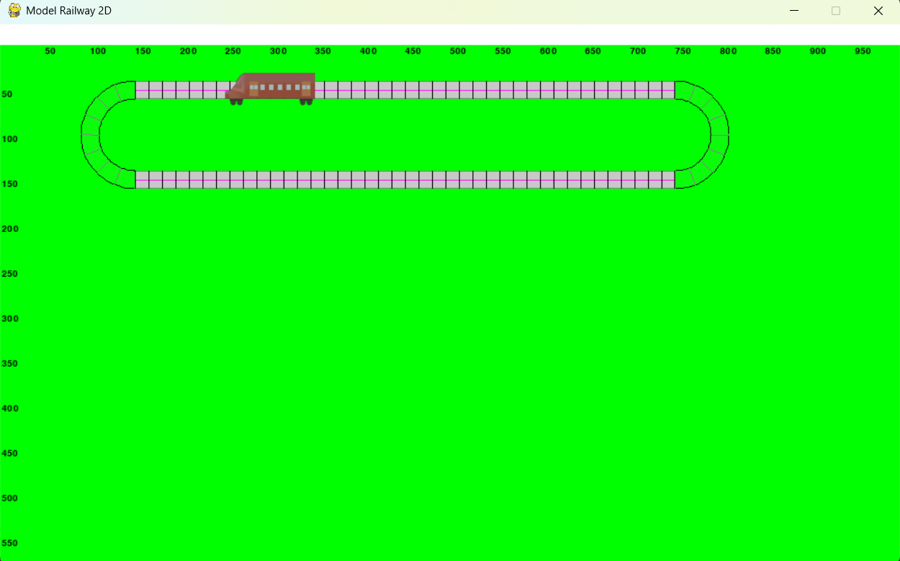
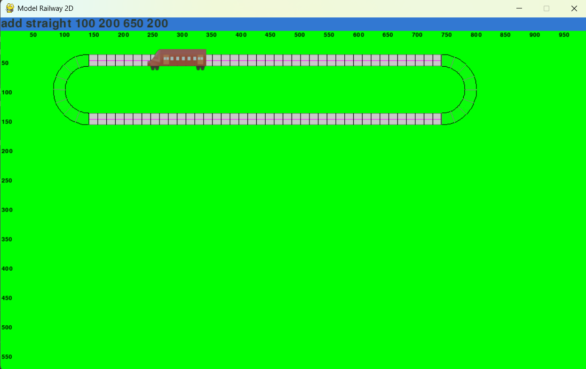
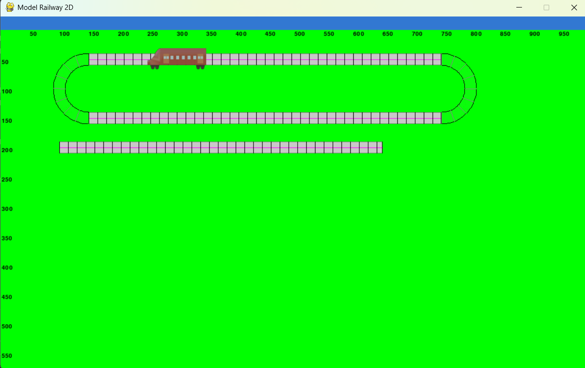

# Model Railway 2D

## How to Play
Run `python main.py` in the terminal.

The command line is shown at the top of the window.

## Commands
The available commands have the following format. The variables are described as `<variable_name>`.
- `add straight <x1> <y1> <x2> <y2>`
- `add curve <x1> <y1> <x2> <y2>`
- `add train <x> <y> <angle>`

 

 

